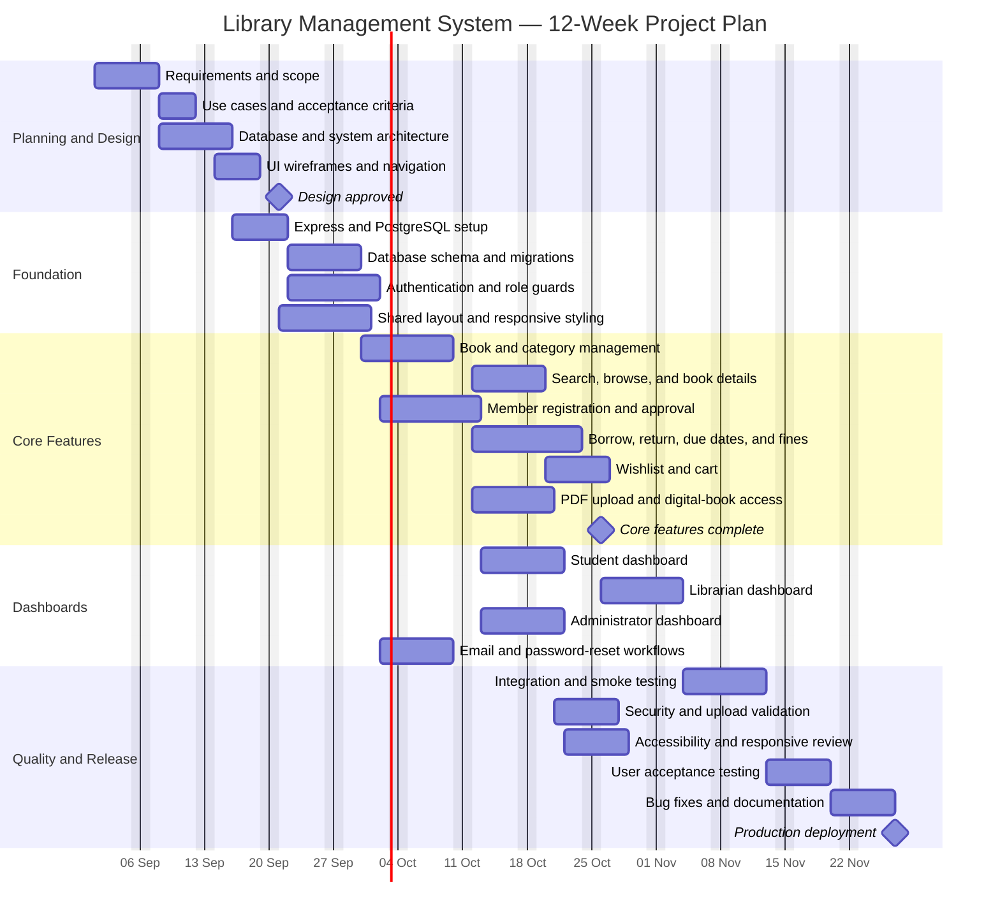

# Library Management System — Gantt Chart

This proposed 12-week plan starts on 1 September 2026. It covers the existing
system scope: student, librarian, and administrator workflows; physical and
digital books; loans; fines; wishlists; testing; and deployment.

## Milestones

| Milestone | Target outcome |
|---|---|
| Design approved | Requirements, architecture, and interface direction agreed |
| Core features complete | Catalog, membership, circulation, wishlist, and digital books functional |
| Production deployment | Testing accepted, documentation complete, and system released |

> GitHub renders the Mermaid block as a visual chart. Change the start date or
> task durations in the block to adjust the schedule.
